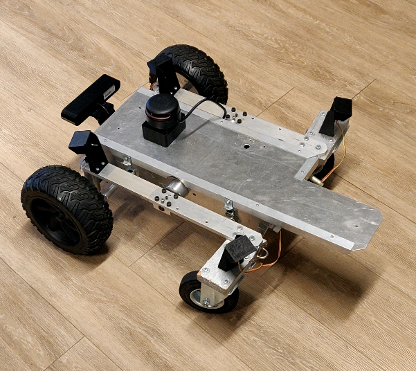
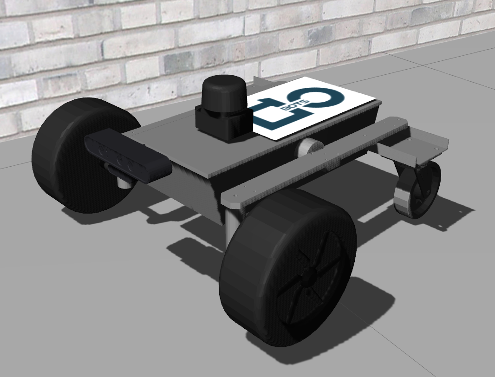

**This document is meant to help port your ROS1 package to ROS2.** While there are some migration guides from ROS1 to ROS2 for individual ROS components, there are still many gaps. I wrote this guide to help with migration from a full robot workspace point of view, including information about build toolchain, launch, urdfs and gazebo, localization, navigation as well as some troubleshooting.

This guide assumes the use of **ROS2 distributions: Eloquent or Foxy** (and not Dashing). All these ROS2 distributions are constantly being tinkered with and updated so it's possible some of the paths/file names could change post the time of writing of this guide (`October 2020`).

## Introduction and code examples:
A good place to start if this is your first time using ROS2 and its build toolchain is the ROS2 tutorials page on the official website: **https://index.ros.org/doc/ros2/Tutorials/**

For this guide we will use ROS1 and ROS2 code for the DoBots RoFox robot as an example (**https://github.com/dobots/rofox**). You may go through the ROS1 and ROS2 versions of files (from the respective branches) and copy them as required.

<!--  -->
<p align="center">
  
  
</p>
<p align="center">The RoFox robot with a depth camera and lidar (for localization and mapping)<p align="center">

## 1. Setting up the package

In your ROS2 workspace, first create a new ROS2 package with the same name as the ROS1 package to be migrated.

(ROS2 packages can be of either the CMake or the Python build type. To migrate a C++ ROS1 package you must create a CMake package. For all other packages you may use either CMake or Python.)

As a running example, I've created a workspace directory `fox_ros2_ws` with a `src` directory and wish to migrate the ROS1 package `fox_gazebo`.

```
cd fox_ros2_ws/src
ros2 pkg create --build-type ament_cmake fox_gazebo
```

To use any additional files from your package at run-time (Eg. launch, world files for `fox_gazebo`), the files have to be added to the 'share' directory of the package at build time. Do this using the following code:
```CMake
# For Cmake package: to the package CMakeLists file (before 'ament_package()'):
install(DIRECTORY
  launch
  worlds
  DESTINATION share/${PROJECT_NAME}/
)
```
```Python
# For Python package: to the setup.py file under data_files:
(os.path.join('share', package_name), glob('launch/*')),
(os.path.join('share', package_name), glob('worlds/*'))
```

To run any additional executable scripts (Eg. ros2 run pkg \<executable>.py), they need to be added to the package 'lib' directory using the following code:
```CMake
# For Cmake package: to the package CMakeLists file (before 'ament_package()'):
# (NOTE: This is the easiest way to add python ros code to your CMake package)
install(PROGRAMS 
  scripts/demo.py
  DESTINATION lib/${PROJECT_NAME}/
)
```
```Python
# For Python package: to the setup.py file under data_files:
(os.path.join('lib', package_name), glob('scripts/*')),
```

## 2. Launch files

ROS2 recommends the usage of Python launch files. A guide to creating these launch files is available here: https://index.ros.org/doc/ros2/Tutorials/Launch-Files/Creating-Launch-Files/.

However, most ROS1 packages use xml-based launch files. Moreover, given that there is the lack of a proper guide on using xml launch files in ROS2, we will focus specifically on **xml-based launch** files here.

### Install launch packages:
First, ensure that you have the launch xml packages installed:
```
sudo apt install ros-<distro>-launch*
```

### Change launch file names to \<name>.launch.xml
ROS2 requires xml launch files to have the additional `.xml` extension.

### Modify tags and parameters:
There are differences in launch xml tags in ROS2 (Details about which xml tags and parameters are available in ROS2 vs ROS1 are available at this link: https://index.ros.org/doc/ros2/Tutorials/Launch-files-migration-guide/). We will mention the most notable changes here.

- The `type` parameter in the `<node>` tag is now defunct and needs to be renamed to its new name: `exec`.

- The `find` command substitution is now replaced by `find-pkg-share` for the share directory and `find-pkg-prefix` for the install directory. (Note: In urdf files, `find` is still used and points to the share directory.)

- To substitute an arguement (or any variable), the `var` command has to be used. For example, to use the value of world_name as world when launching gazebo:
  ```xml
  <arg name="world_name" default="abc.world"/>
  ...
  <include file="$(find-pkg-share gazebo_ros)/launch/gazebo.launch.py">
    <arg name="world" value="$(var world_name)"/>
    ...
  ```

- No more global parameters. ROS2 has no concept of global parameters and thus parameters have to be passed for every node separately within the `<node>` tag.
As an example, `robot_description` is no longer a global parameter and thus needs to be passed to the `robot_state_publisher` node:
```xml
<node pkg="robot_state_publisher" exec="robot_state_publisher" name="robot_state_publisher">
        <param name="robot_description" value="<robot name="robo1"><link name="base_link"><visual><geometry><sphere radius="1.0"/><geometry></visual></link></robot>" />
</node>
```

## 3. Gazebo simulations

To launch a simulation of your robot in Gazebo in ROS2: 
- Install the ros gazebo packages: ```sudo apt install ros-<distro>gazebo-ros-pkgs```

- Note that spawning models also requires an **updated version of gazebo9 (9.15 or beyond)**

- The Gazebo environment variables (such as `GAZEBO_MODEL_PATH`) need to be set so that Gazebo can replace paths such as `package://` from the urdf. If using the gazebo_ros launch files, the best way to do this is add to the package.xml (of fox_description for Eg.):
  ```xml
  <export>
    <gazebo_ros gazebo_model_path="${prefix}/../"/>
    <gazebo_ros gazebo_plugin_path="${prefix}/lib"/>
    <gazebo_ros gazebo_media_path="${prefix}"/>
  </export>
  ```
  More details are available at the gazebo_ros_pkgs wiki: https://github.com/ros-simulation/gazebo_ros_pkgs/wiki/ROS-2-Migration:-Gazebo-ROS-Paths

- There are many urdf changes to Gazebo sensors in ROS2. These can be checked at the 
gazebo_ros_pkgs wiki: (https://github.com/ros-simulation/gazebo_ros_pkgs/wiki/ROS-2-Migration:-Camera). You may also have a look at the urdf files in the ROS2 `fox_description` package as an example.

### Launch files
- xacro: Loading the robot description urdf files using xacro can be tricky to set up using the xml launch files. I recommend using a python launch file instead for this (especially in eloquent due to lack of `command` substitution).\
As an example, the `fox_description` package contains a launch file `fox_robstatepub_xacro.launch.py` that builds the urdf file using xacro and passes it to the robot_state_publisher node. The model can later be spawned in gazebo using the `/robot_description` topic published by the robot_state_publisher node.

- When launching Gazebo, it is recommended to use the launch file `gazebo.launch.py` within the `gazebo_ros` package. This will start both gz_server and gz_client nodes as well as export the gazebo environment variables.

- To spawn a model/robot in Gazebo, the ROS1 `spawn_model` node functionality has been replaced by the ROS2 `spawn_entity.py`. As an example, the robot can be spawned using the information from the `/robot_description` topic:
  ```xml
  <node pkg="gazebo_ros" exec="spawn_entity.py" name="spawn_tb3" args="-entity fox_robot -topic /robot_description"/>
  ```
  More options and information is available at: https://github.com/ros-simulation/gazebo_ros_pkgs/wiki/ROS-2-Migration:-Spawn-and-delete.

## 4. Navigation2

- The `move base` package from ROS1 has been replaced by `Navigation2` (nav2) in ROS2.
- The name of the package is misleading though because nav2 includes both localization and navigation functionality. Importantly, this means that the `amcl` package functionality is now part of nav2.
- Example launch files for localization (amcl) and navigation are available in the `fox_localization` and `fox_navigation` packages.
- All nodes in Navigation2 are LifeCycle nodes and thus need to be in the right state to function properly. You could use the Navigation2 tool (panel) in rviz to pause/reset these lifecycle nodes correctly.

## Further information:
- Guide on how to migrate code and other CMake commands: https://index.ros.org/doc/ros2/Contributing/Migration-Guide/

- Creating and using your own message and service types: See `fox_ekf` package and this link: https://index.ros.org/doc/ros2/Tutorials/Single-Package-Define-And-Use-Interface/

- If all this is too much work, you may also try these tools:\
 Launch file migrator: https://github.com/aws-robotics/ros2-launch-file-migrator\
 Other migration tools:
 https://github.com/awslabs/ros2-migration-tools/tree/master/porting_tools

## Troubleshooting:

### Gazebo startup error
Sometimes you may need to `source /usr/share/gazebo/setup.sh` for gazebo to startup correctly and avoid the error: `gazebo::rendering::Camera; typename boost::detail::sp_member_access<T>::type gazebo::rendering::Camera*]: Assertion `px != 0' failed.`

### Substitutions in launch.xml
Some of the partial substitutions (Eg. $(sub)/abc/xyz.rviz) don't work well when used in `args`. An alternative is to define a separate variable and substitute that in `args` (Eg. A variable `rviz_cfg_path` is defined in `fox_gazebo/launch/gazebo.launch.xml` and then this variable is used in `args` when launching rviz at the end of the launch file).

### On ros2-eloquent, in order to run Navigation2, BehaviorTree.CPP is required to be built from source (https://github.com/BehaviorTree/BehaviorTree.CPP/tree/ros2-devel)
https://github.com/ros-planning/navigation2/issues/1948

### LaserScan not visible
In Rviz, the 'Reliability' setting for the LaserScan has to be changed to 'Best Effort' for rviz to visualize Laser Scans.

### Rosserial
At the time of writing, ROS2 does not have a `rosserial` package (to perform serial communication with a microcontroller for eg.). Work on this is ongoing and the following link provides some alternatives : https://github.com/osrf/ros2_serial_example.